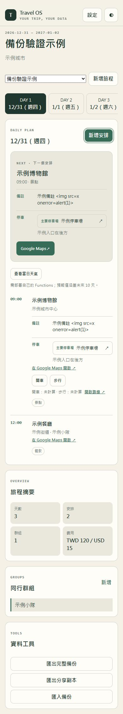

> 最新產品基準：2026-10-09 起依 ADR-006 僅支援 Spark 免費設定、免 Key 地圖與路線；移除全部天氣及付費 Google API。以下較早驗證紀錄屬歷史行為，不是現行功能或通過證據。

# Travel OS 首次設定與行程功能驗證報告

首次驗證日期：2026-09-29；最新追加驗證：2026-10-08（Asia/Taipei）。下方初次結果保留為歷史紀錄，最新結果以追加紀錄為準。

驗證範圍：獨立的 [Travel-OS-first-run repository](https://github.com/chenzhu254/Travel-OS-first-run) 與[測試網站](https://chenzhu254.github.io/Travel-OS-first-run/)。沒有修改原作者的 repository，也沒有向原作者的 Firebase 專案寫入。本文不記錄帳號密碼、Firebase Web config、API Key 或資料庫識別資料。

## 結論

使用者已能在自己的 GitHub Pages 網站依設定精靈連上獨立 Firebase 專案，登入後建立與讀回私人旅程。景點的備註、Google Maps 連結與停車資訊已在「下一站」和時間線顯示。追加驗證建立了第二趟跨年旅程、兩個同行群組及跨時區航班，均成功同步。航班起降日期與時區原先未顯示在行程卡片；已於 `5819cf7` 修正，並在本機瀏覽器確認。

這是功能與權限測試的證據，不是完整安全稽核，也不代表每種瀏覽器、Google API 或真實多人協作情境都已驗證。

## 實測結果

| 項目 | 結果 | 證據與範圍 |
| --- | --- | --- |
| GitHub Pages 與 CI | 通過 | 公開網站可開啟；航班顯示修正 `5819cf7` 的 [CI](https://github.com/chenzhu254/Travel-OS-first-run/actions/runs/36498688862) 與 [Pages 部署](https://github.com/chenzhu254/Travel-OS-first-run/actions/runs/36498688793) 均成功。新版頁面已載入新的 JavaScript 資源。 |
| 設定精靈 Steps 1–6 | 通過 | 使用獨立 Firebase 專案的 Web config、Realtime Database URL、Email／密碼登入，完成本人範圍的診斷讀寫並進入工作區。密碼由使用者在網站自行輸入。 |
| Firebase 旅程讀寫 | 通過 | 實際建立第一趟三日旅程，換新分頁重新登入後讀回；新增景點及群組，網站顯示已同步，Firebase 控制台可見景點的備註、Maps 連結與停車資料。 |
| 下一站資訊 | 通過 | 下一站與時間線同時顯示景點備註、Google Maps 連結、主要停車場及停車備註。 |
| 多旅程、日期及群組 | 通過 | 雲端另建一趟 `2026-12-31` 至 `2027-01-02` 的旅程；切換到 `2027-01-01` 正常。第一趟旅程建立兩個群組，第二趟維持零群組。 |
| 跨日期、跨時區航班儲存 | 通過 | 雲端建立從 `Asia/Taipei` 的 `2027-01-01 23:00` 出發、在 `Asia/Tokyo` 的 `2027-01-02 03:00` 抵達的示例航班。 |
| 航班起降資訊顯示 | 已修正並通過本機瀏覽器驗證 | 新版在下一站及時間線列出出發／抵達機場、各自日期時間與時區；本機旅程重整後仍可讀回。雲端網站的新版畫面尚未重新登入重測。 |
| 無設定本機模式 | 通過 | 全新本機網站可跳過雲端設定、建立跨年旅程及航班；重整後旅程與航班仍存在。 |
| 手機版面 | 部分通過 | 曾在 390×844 的 Chrome 視窗檢查雲端旅程，主內容可閱讀，日期分頁以水平捲動呈現。尚未完成多手機瀏覽器及完整鍵盤操作驗證。 |
| Firebase 權限 | 模擬器通過、正式雲端部分通過 | 正式雲端已驗證 owner 本人讀寫；[CI 規則測試](https://github.com/chenzhu254/Travel-OS-first-run/actions) 涵蓋未登入、陌生人、viewer、editor 升權及跨旅程索引。尚未以第二個真人帳號在正式雲端重測。 |
| JSON 備份與還原 | 邏輯測試通過、瀏覽器流程未完成 | 自動測試覆蓋 schemaVersion、欄位正規化、無效資料拒絕、分享副本去除備註／停車／金額。本次瀏覽器環境未提供匯出下載事件，也未完成乾淨狀態下的匯入預覽與還原，因此不能宣稱端到端通過。 |
| Google Maps | 外部連結產生通過 | 景點與停車場顯示 Maps 連結；未逐一點開導航目的地，也未測試需要 API Key 的 Google Cloud 額度、停用 API 或計費失敗情境。 |

本機執行 `npm run check`：**68 個單元測試通過，正式建置成功**。Firebase Emulator 的權限整合測試由 GitHub CI 執行；本機 Windows 環境的 Emulator 執行限制不應被解讀為權限測試失敗。

## 發現與處理

1. 首次雲端旅程建立時，原程式先讀取尚未建立 membership 的旅程節點，遭 Rules 拒絕；`30385b1` 改為先查本人旅程索引。
2. 首次新增景點時，Firebase transaction 可能先以空快取呼叫更新函式；`ac16a19` 修正交易重試，`38cc982` 加入 Emulator 整合測試。
3. 部署後舊分頁曾載入快取中的舊 JavaScript。測試時確認資源雜湊更新，並在新分頁重新驗證；這不等於每位使用者的舊分頁都已立即更新。
4. 跨時區航班雖可儲存，卡片只顯示機場代碼；`5819cf7` 補上起降日期、時間與時區，並以本機瀏覽器和單元測試確認。

## 仍需完成的驗證

1. 由另一名測試使用者在正式測試 Firebase 專案實測陌生人、viewer、editor 權限；不能用 owner 帳號的成功讀寫替代。
2. 在支援下載的瀏覽器完成私人完整備份、分享副本下載與內容檢查，再於乾淨的本機模式執行匯入預覽與還原。匯入前應保留現有私人資料備份。
3. 以新版已部署網站重新登入，確認雲端航班起降資訊顯示；再測不同幣別費用、切換 Firebase 專案後快取隔離，以及手機／鍵盤完整操作。
4. GitHub 與 Google 帳戶使用的是已登入帳戶。從零註冊、電子郵件驗證及涉及條款接受的流程尚未實測，不能標為通過。

首次設定的逐步紀錄見[首次設定實測紀錄](FIRST_TIME_SETUP_AUDIT.zh-TW.md)。

## Google 功能補回紀錄（2026-09-29）

比對九州自駕原站後，確認初版開源專案遺漏了 Places 地點搜尋，以及由 Firebase Functions 呼叫的 Routes、Geocoding、Weather。新版在精靈 Step 3 加入選填 Browser Key 與獨立的進階 Functions 指引；Step 5 會辨識 Places 載入狀態和 Functions 是否部署。新增安排可透過 Places 選地點，行程卡片可手動請求路程與當日天氣；若未設定 API，仍可手動輸入及使用免 Key Google Maps 連結。

本機執行 `npm run check`：69 個單元測試通過、Functions 語法檢查及 Vite 建置通過；另以 `node --test tests/google-functions.cjs` 驗證三個付費 callable 的登入與輸入拒絕。瀏覽器實測 Step 3 顯示、錯誤 Browser Key 阻擋、未填 Key 可進 Step 4，以及無 Functions 時天氣提示。Functions 模組可載入，依賴套件通過 high 等級稽核。**尚未使用真實 Browser Key、Google Billing 或 Blaze 專案測試 Places 選取與 Routes／Geocoding／Weather 的付費 API 呼叫，也未部署 Functions。**先前報告中的 Google Maps「僅外部連結」結論只適用於補回前版本。

## 追加驗證（2026-10-08）

重新 fetch 獨立測試 repository 後，確認本機與遠端 `main` 均為 `1552e44`，工作目錄乾淨。這輪以該部署版本測試匯出，以本機修正版測試乾淨狀態還原。測試旅程只有「示例城市」「示例博物館」等合成資料，沒有使用真實帳密、API Key 或私人行程。

| 項目 | 結果 | 實際驗證 |
| --- | --- | --- |
| 私人完整備份下載 | 通過 | 在已部署網站實際下載 JSON：保留 1 趟跨年旅程、2 筆安排、1 個群組、備註、停車資訊及 TWD／USD 金額。 |
| 分享副本下載 | 通過 | 實際下載並解析 JSON：保留安排，移除群組、備註、停車資料、自訂 Maps 連結及金額。名稱、地址與日期仍保留，分享前仍須自行確認內容。 |
| 乾淨狀態匯入 | 發現入口缺漏，修正後通過 | 初始空資料首頁原本沒有匯入按鈕；新增入口後，不需先建立空旅程即可選檔、看到「1 趟旅程／2 筆安排」預覽並還原。 |
| 取消／確認匯入 | 通過 | 取消分享副本預覽後，原本群組與 TWD 120／USD 15 費用仍存在。確認還原分享副本並重整後，群組為 0、費用為空；再還原完整備份可恢復原示例資料。 |
| 備註及停車資訊 | 通過 | 匯入完整備份並重整後，下一站及時間線仍顯示備註、主要停車場與停車備註。備註中的 HTML 測試字串顯示成文字，DOM 沒有產生圖片元素。 |
| 不同幣別費用 | 通過（本機／還原流程） | 摘要分別顯示 TWD 120 與 USD 15，沒有混加成單一金額。 |
| 未設定 Google API | 通過（本機降級） | 按開車及天氣按鈕顯示需登入自己的 Firebase 並部署 Functions，沒有假造路程或天氣結果；免 Key Maps 連結仍存在。 |
| 手機與鍵盤 | 部分通過 | Chromium 的 390×844 視窗沒有整頁水平溢出；下一站、Maps、備註、停車資訊及摘要可閱讀。以 Enter 操作建立、匯入／取消等按鈕，Escape 可關閉新增安排並將焦點還給原按鈕。尚未驗證實體手機、Safari、螢幕閱讀器及所有鍵盤路徑。 |
| Google 後端請求與錯誤處理 | 模擬回應通過 | 6 個 Node 測試覆蓋登入、座標／日期邊界、官方請求欄位、成功結果、HTTP 403／429、Geocoding 無結果／配額不足、離線、預報範圍外及個人／全站每日上限。HTTP、Secret 與資料庫使用替身，**不代表真實 Google API 或正式 Functions 已部署驗證**。 |

### 修正的問題

- 空白、null、布林等座標原本會經 `Number()` 變成 0；改為只接受有限數值，保留合法的 0 座標。不存在的日期也在耗用配額前拒絕。
- Geocoding 的 JSON `OVER_QUERY_LIMIT`／`OVER_DAILY_LIMIT` 現在回傳配額錯誤；找不到地址或路線會附帶 `NO_RESULTS` 原因，網站不再誤導使用者重新部署 Functions。
- 不完整的路線與溫度資料不再被轉為有效估算；未提供降雨機率時明確顯示「降雨機率未提供」。
- 空資料首頁新增「匯入備份」，與工作區使用同一個選檔流程。

本機驗證：`npm run check` **70 個單元測試、Functions 語法檢查及正式建置通過**；`node --test tests/google-functions.cjs` **6 個測試通過**。正式雲端多人權限、切換實際 Firebase 專案、真實 Browser Key／Billing／Blaze Functions 與從零註冊仍待完成；不沿用前次 owner 測試代替這些結果。

重新執行套件稽核時，發現鎖定檔的 gRPC 與 source-map-js 受到新公告影響。保留 Firebase 12，不採用稽核工具建議的重大降版；以 override 將 gRPC 固定到官方修補版 `1.13.6`，並更新 source-map-js 至 `1.2.2`。根目錄稽核已為 0 個漏洞；Functions 稽核沒有 high／critical，仍有 2 個 moderate 的間接依賴公告。Firebase 的上游依賴採用已修補 gRPC 後，可移除這項 override。公告：[gRPC 憑證檢查](https://github.com/advisories/GHSA-m9gg-hp2v-232j)、[gRPC 錯誤訊息](https://github.com/advisories/GHSA-f596-whhp-79r4)、[source-map-js](https://github.com/advisories/GHSA-68fv-2mgg-jv7q)。

參考本輪重新核對的官方格式：[Routes computeRoutes](https://developers.google.com/maps/documentation/routes/reference/rest/v2/TopLevel/computeRoutes)、[Geocoding 請求與狀態](https://developers.google.com/maps/documentation/geocoding/guides-v3/requests-geocoding)、[Weather forecast.days.lookup](https://developers.google.com/maps/documentation/weather/reference/rest/v1/forecast.days/lookup)。

手機視窗驗證截圖（合成資料）：

## 2026-10-09 — Spark 免費流程與天氣移除

- 不接收 Maps Browser Key，不載入 Places，不呼叫／部署 Functions；舊版記住的 Maps key 在設定解析時移除，Firebase 設定沿用。
- 完整移除天氣 API、按鈕、快取、外部天氣查詢與樣式。
- 相鄰安排提供免 Key 開車／步行 Maps URL，保留目的地、主要／備用停車場與備註。
- `npm run check`：69 項測試及 production build 通過；`npm audit --audit-level=high`：0 vulnerabilities。
- 實際本機瀏覽器：三日跨年示例資料重整讀取正常，下一安排備註／停車與 TWD、USD 分幣別保留；無天氣區塊，無 Maps API script，含兩種正確路線連結，HTML 備註安全呈現。
- 精靈 Steps 1–3 使用合成 config 檢查格式及免 Key 導航說明，未連線任何合成或作者雲端。Step 4/5 真實登入與資料讀寫尚待部署後重驗；本次未改 Auth、RTDB 儲存或 Rules。
- 截圖：`assets/verification-spark-2026-10-09.png`、`assets/verification-spark-wizard-2026-10-09.png`，僅合成資料。
- Firebase 計費方案只能由擁有者在控制台確認；此軟體不變更計費或既有資源，不保證 Spark 無限額度。PR 尚未合併時公開網站仍為舊版。
